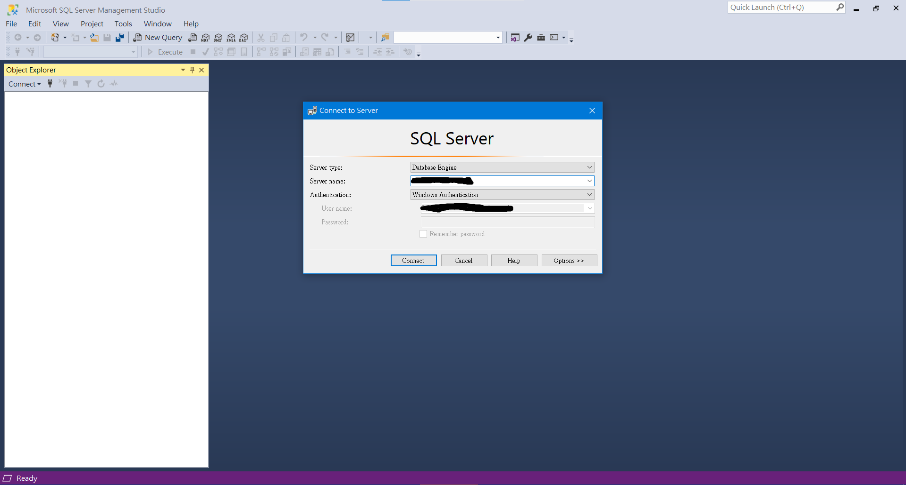
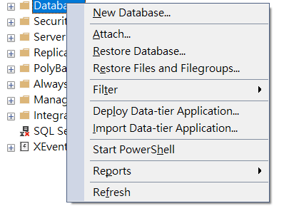
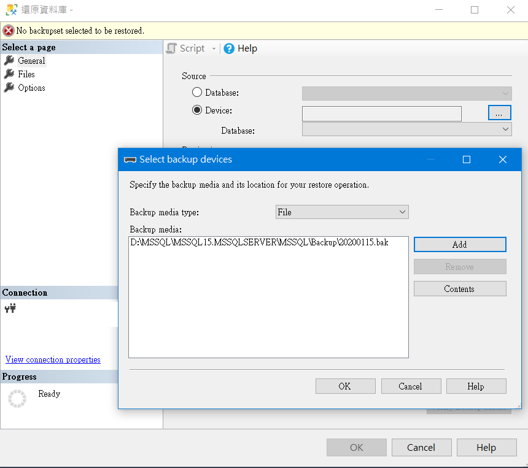
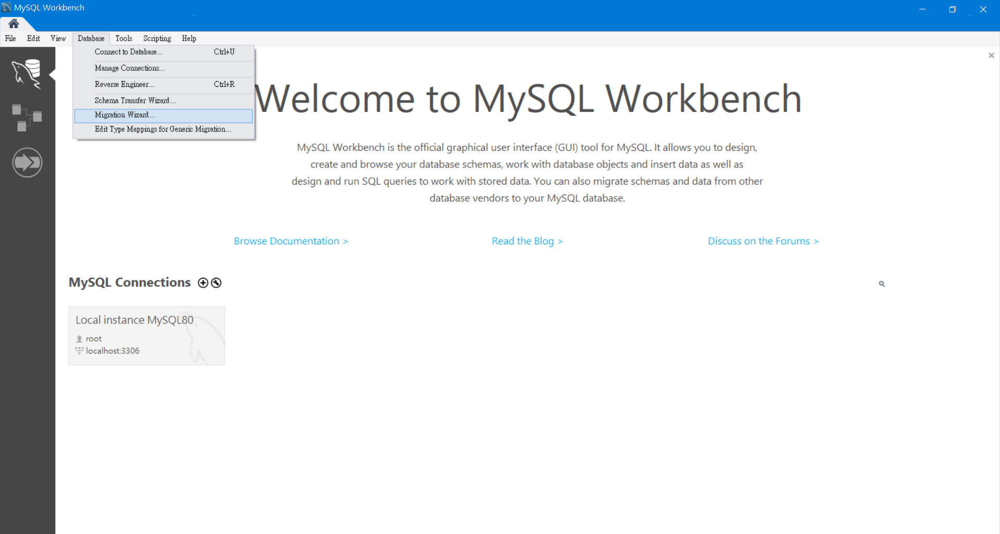
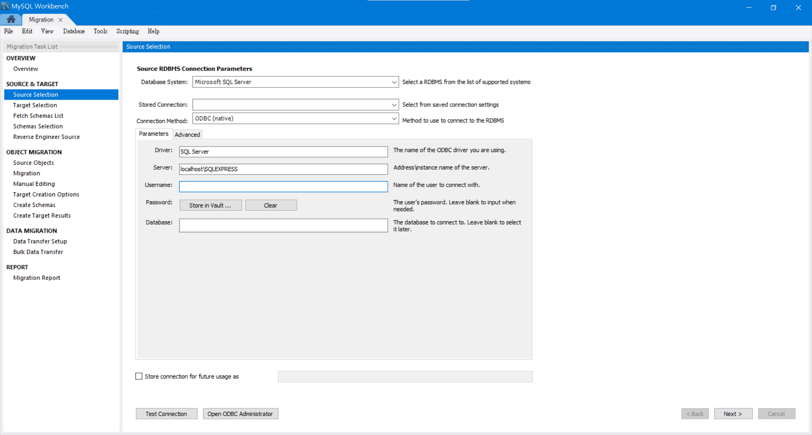
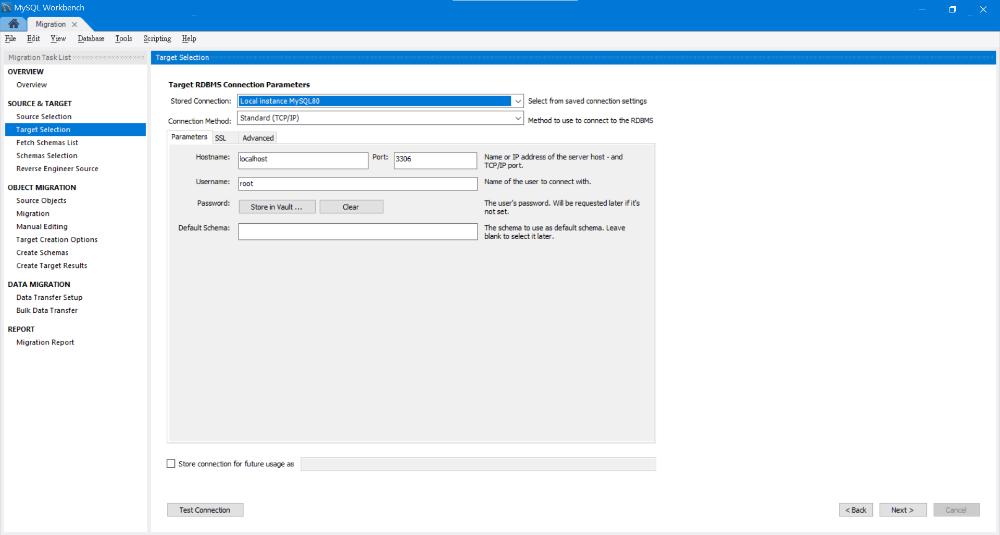
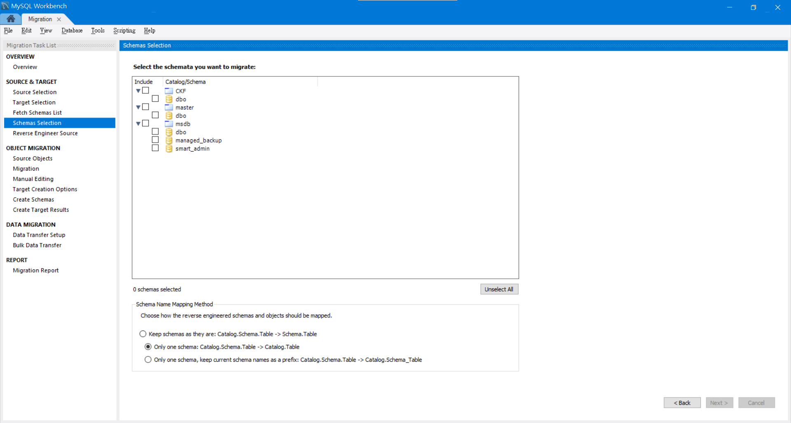
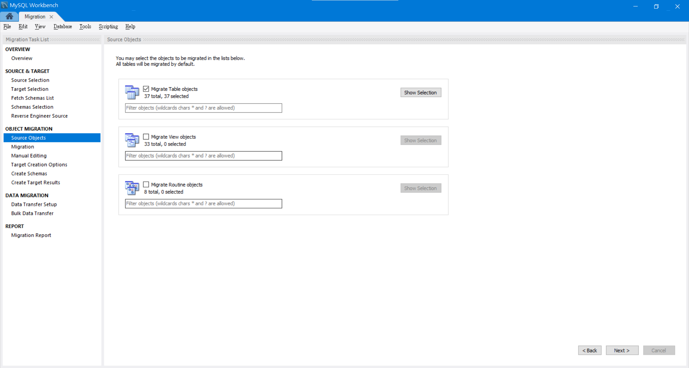
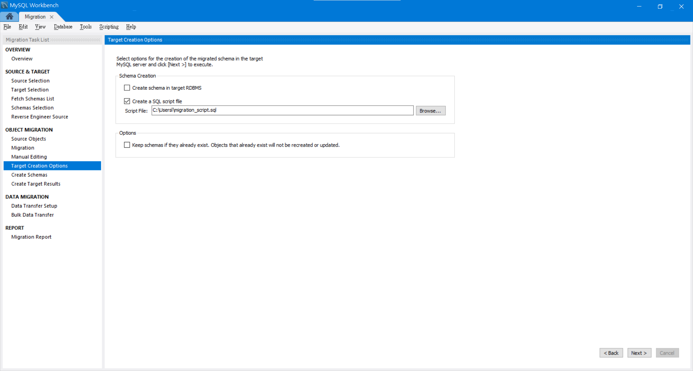

# Microsoft SQL Server Migrate to MySQL
It is a guide of MSSQL migration in Windows 10.

## Environment and Migration Tools
- MySQL Workbench 8.0
- Microsoft SQL Server Management Studio
- PowerShell ISE
- phpMyAdmin

## Migration Guide
1. Import database to MSSQL
    - Open Microsoft SQL Server Management Studio and connect to server
    
    - Right click "Databases" and select Restore Database
    
    - Select Device under Source, add the bak file and apply
    
    - Check the database correct or not
    

2. Convert schema
    - Open MySQL Workbench and select "Migration Wizard"
    
    - Select MSSQL as the source with ODBC(native) connect method
    
    - Select MySQL as the target
    
    - Select the target database and schema prefix(optional)
    
    - Select table object
    
    - Create SQL script file (Create the schema directly may cause incompatibility)
    
    - Please do not import the data through "Migration Wizard" if the data not in UTF8 or ASCII. It will cause encoding problem.

3. Modify the script
    - Delete "Visible" or "Invisible"
        ```bash
       #example
       INDEX `column` (`table` ASC) VISIBLE);
        ```
     - Check CHAR size not exceed 191 (Only required for low MySQL version)
       ```bash
       #example  
         `name` CHAR(255) NULL
       ```

4. Import the script to MySQL through phpMyAdmin

5. Export all table to CSV (UTF-8)
    - Open PowerShell ISE and copy the following script
    ```bash
   $server = "SERVER_NAME"
   $database = "TABLE_NAME"
   $tablequery = "SELECT schemas.name as schemaName, tables.name as tableName from sys.tables inner join sys.schemas ON tables.schema_id = schemas.schema_id"
   
   #Delcare Connection Variables
   $connectionTemplate = "Data Source={0};Integrated Security=SSPI;Initial Catalog={1};"
   $connectionString = [string]::Format($connectionTemplate, $server, $database)
   $connection = New-Object System.Data.SqlClient.SqlConnection
   $connection.ConnectionString = $connectionString
   
   $command = New-Object System.Data.SqlClient.SqlCommand
   $command.CommandText = $tablequery
   $command.Connection = $connection
   
   #Load up the Tables in a dataset
   $SqlAdapter = New-Object System.Data.SqlClient.SqlDataAdapter
   $SqlAdapter.SelectCommand = $command
   $DataSet = New-Object System.Data.DataSet
   $SqlAdapter.Fill($DataSet)
   $connection.Close()
   
   
   
   # Loop through all tables and export a CSV of the Table Data
   foreach ($Row in $DataSet.Tables[0].Rows)
   {
       $queryData = "SELECT * FROM [$($Row[0])].[$($Row[1])]"
   
       #Specify the output location of your dump file
       $extractFile = "{{CHANGE_TO_LOCAION}}$($Row[0])_$($Row[1]).csv"
   
       $command.CommandText = $queryData
       $command.Connection = $connection
   
       $SqlAdapter = New-Object System.Data.SqlClient.SqlDataAdapter
       $SqlAdapter.SelectCommand = $command
       $DataSet = New-Object System.Data.DataSet
       $SqlAdapter.Fill($DataSet)
       $connection.Close()
   
       $DataSet.Tables[0]  | ConvertTo-Csv -NoTypeInformation | select -Skip 1 | out-file $extractFile -Encoding UTF8
   } 
   ```
   - Change the params to fit your environment and run the script
   - All the csv will in UTF-8 with BOM format
        - If the import show error, please try to change encoding to UTF-8 without BOM
   - If the data contains timestamp or datetime
        - Open it by excel
        - Select the columns that contain date
        - Place "yyyy-mm-dd h:mm:ss" as the format
        - Apply and save
   - Import the csv by phpMyAdmin
        - If the import time exceeded 300 seconds, modify config.inc.php
            ```bash
            #xampp\phpMyAdmin\config.inc.php  
            $cfg['ExecTimeLimit'] = 0;  
            ```      
        
   